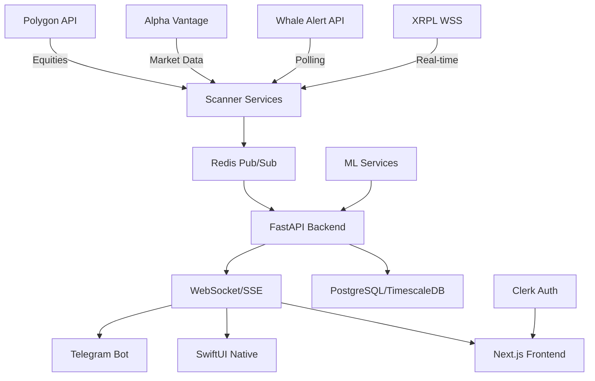

# zkalphaflow Architecture Overview

## 🏗️ Current System Architecture

### Container Registry (DigitalOcean)
Based on `docker-compose.prod.yml`, we have **3 containers** registered:
1. `registry.digitalocean.com/zkalphaflow/web:latest` - Next.js frontend
2. `registry.digitalocean.com/zkalphaflow/api:latest` - FastAPI backend
3. `registry.digitalocean.com/zkalphaflow/worker:latest` - Background worker

### Dockerfiles
- **Main API** (`./Dockerfile`) - Multi-stage Python 3.11 build for FastAPI with ML libraries
- **Web Frontend** (`./apps/web/Dockerfile`) - Node.js 20 Alpine for Next.js
- **Duplicate?** (`./apps/web/Dockerfile 2`) - Appears to be a backup/duplicate

## 📁 Project Structure

```
windsurf-project-2/
├── .do/                    # DigitalOcean deployment config
│   └── app.yaml           # App Platform specification (source-based builds)
│
├── api/                    # FastAPI endpoints (25 files)
│   ├── health.py          # Health check endpoint (/health)
│   ├── correlations.py    # Multi-asset correlation engine
│   ├── latency.py         # Latency tracking (NO MOCK DATA)
│   ├── dashboard.py       # Dashboard endpoints
│   ├── flows.py           # Flow tracking
│   ├── analytics.py       # Analytics endpoints
│   ├── wallets.py         # Wallet analysis
│   ├── billing.py         # Subscription/billing
│   └── ...
│
├── app/                    # Core application
│   ├── main.py            # FastAPI app entry point
│   └── config.py          # Environment configuration
│
├── apps/web/               # Next.js frontend
│   ├── app/               # App router pages
│   ├── components/        # React components (NO MOCK DATA)
│   ├── package.json       # Node dependencies
│   └── Dockerfile         # Web container config
│
├── scanners/               # Data collectors (19 files)
│   ├── xrpl_scanner.py    # XRPL ledger monitoring
│   ├── whale_scanner.py   # Whale Alert integration
│   ├── futures_scanner.py # Futures tracking
│   ├── godark_*.py        # GoDark dark pool monitors
│   └── ...
│
├── predictors/             # ML/prediction services (15 files)
│   ├── alpha_macro_tracker.py
│   ├── polygon_macro_tracker.py
│   ├── futures_tracker.py
│   └── ...
│
├── workers/                # Background workers (9 files)
│   ├── correlator.py
│   ├── scanner.py
│   └── ...
│
├── ml/                     # Machine learning models (7 files)
│   ├── latency_predictor.py
│   └── ...
│
├── services/               # Service layer
│   └── worker/
│       └── telegram_alert.py
│
├── billing/                # Billing services (4 files)
│   └── onchain_watchers.py
│
├── db/                     # Database (7 files)
│   ├── schema.py
│   └── migrations/
│
└── deployment/
    ├── deploy.sh          # One-click deployment script
    ├── docker-compose.prod.yml
    └── .github/workflows/digitalocean-deploy.yml
```

## 🔄 Data Flow Architecture



## 🚀 Deployment Configuration

### DigitalOcean App Platform
- **Region**: NYC
- **Services**: 3 (web, api, worker)
- **Database**: Redis (managed)
- **Build**: Source-based from GitHub
- **Auto-deploy**: Enabled on push to main

### Service Specifications
| Service | Instance | Port | Build Source |
|---------|----------|------|--------------|
| Web | basic-xxs | 3000 | apps/web/ |
| API | basic-xs | 8000 | root |
| Worker | basic-xxs | - | root |

### Domains
- Primary: `zkalphaflow.com`
- API: `api.zkalphaflow.com`
- Alias: `www.zkalphaflow.com`

## 🔑 Key Features

### Real-Time Data Sources
- **XRPL**: Live ledger monitoring via WebSocket
- **Whale Alert**: Large transaction tracking
- **Alpha Vantage**: Futures/forex/equities (600 calls/min)
- **Polygon**: Equities/options data
- **Ethereum**: Via Alchemy WebSocket

### Core Functionality
1. **Dark Pool Detection**: ZK-proof monitoring
2. **Multi-Asset Correlations**: XRP vs SPY/Gold/Futures
3. **Latency Tracking**: Exchange latency monitoring
4. **ML Predictions**: Prophet-based forecasting
5. **Slack Integration**: Courses & alerts
6. **Real-time SSE**: Live flow updates

### Authentication & Security
- **Clerk**: Production auth for zkalphaflow.com
- **API Keys**: Stored as DigitalOcean secrets
- **CORS**: Configured for production domains

## 📊 Database Architecture

### PostgreSQL (Production)
- TimescaleDB extension for time-series
- Managed by DigitalOcean
- Port: 25060
- SSL: Required

### Redis
- Pub/Sub for real-time events
- Cache layer
- Managed by DigitalOcean
- Channel: `zk_alpha_flow`

## 🔄 Current Status

### ✅ Completed
- Removed ALL mock data from frontend/backend
- Configured source-based builds (fixed "pre-built image" issue)
- Added health endpoints
- Multi-stage Docker builds
- ML dependencies added

### 🚧 Pending Setup on DigitalOcean
1. Add `CLERK_SECRET_KEY` as secret
2. Configure PostgreSQL credentials
3. Add API keys as secrets (see ENV-SECRETS.md)
4. Verify Redis connection

### 📈 Performance Targets
- Detection rate: >75% for flows >$25M
- Price impact correlation: >2% within 15min
- SSE latency: <100ms
- API response time: <500ms p95

## 🛠️ Development Workflow

### Local Development
```bash
# Backend
python3 -m uvicorn app.main:app --reload --port 8000

# Frontend
cd apps/web && npm run dev

# Both use .env.local for local config
```

### Deployment
```bash
# Automatic on push to main
git push origin main

# Manual deployment
./deploy.sh
```

### Monitoring
```bash
# View logs
doctl apps logs zkalphaflow --follow

# Check health
curl https://api.zkalphaflow.com/health
```

## 📝 Important Notes

1. **NO MOCK DATA**: All mock data has been removed. Components require real API data.
2. **Secrets Management**: Never commit API keys. Use DigitalOcean secrets.
3. **Port Configuration**: API uses `${PORT}` env variable for DigitalOcean compatibility.
4. **Build Process**: Uses GitHub source builds, not pre-built images.
5. **Multi-Asset Support**: Configured for XRP, BTC, ETH, SPY, Gold correlations.

## 🔗 Resources

- **Documentation**: `/docs/deployment-troubleshooting.md`
- **Secrets Guide**: `/ENV-SECRETS.md`
- **Deployment Resolution**: `/DEPLOYMENT-RESOLUTION.md`
- **API Docs**: https://api.zkalphaflow.com/docs
- **GitHub**: https://github.com/Nexa-Inc25/xrpcoreflowalpha
